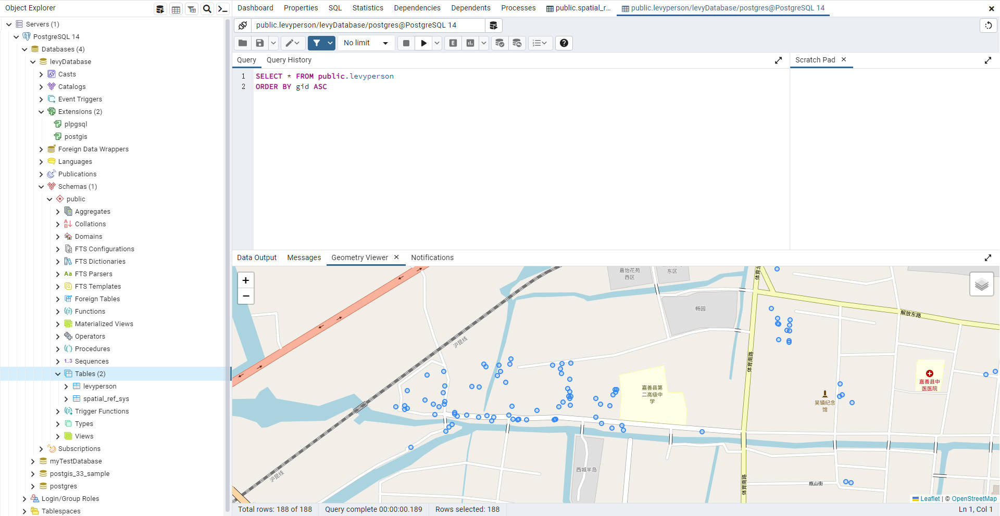

# **postgis**
PostGIS是在 PostgreSQL 上构建的地理空间扩展，通过将地理空间功能添加到 PostgreSQL 中，使其成为一个功能强大的地理信息系统。通过结合 PostgreSQL 的可靠性和稳定性，PostGIS提供了一个强大而灵活的地理空间数据管理和分析平台。PostGIS是作为一个 PostgreSQL 的插件或扩展存在的。


# 一、postgis导入数据
导入数据之前，需要新建数据库，并在数据库上安装postgis扩展，然后再打开postgis的应用窗口，选择对应的路径并给定名字和坐标系。
如果报错，请注意你的路径中是否含有中文字符，并且确保你的postgis扩展添加到了这个数据库上。


# 二、使用Sequelize
## 使用Sequelize 操作表数据时，类型之间的对应关系

```javascript
- INTEGER：对应 Sequelize 的 DataTypes.INTEGER。
- VARCHAR：对应 Sequelize 的 DataTypes.STRING。
- TEXT：对应 Sequelize 的 DataTypes.TEXT。
- BOOLEAN：对应 Sequelize 的 DataTypes.BOOLEAN。
- DATE：对应 Sequelize 的 DataTypes.DATE。
- TIMESTAMP：对应 Sequelize 的 DataTypes.DATE 或 DataTypes.DATEONLY。
- DECIMAL 或 NUMERIC：对应 Sequelize 的 DataTypes.DECIMAL。
- JSON 或 JSONB：对应 Sequelize 的 DataTypes.JSON 或 DataTypes.JSONB。
```
## 1. 连接到 PostgreSQL 数据库
```javascript
const { Sequelize, DataTypes } = require('sequelize');
// 连接到 PostgreSQL 数据库
const sequelize = new Sequelize('your_database', 'your_username','your_password', {
    host: 'localhost',
    dialect: 'postgres',
});
```
## 2. 定义模型model
1. 模型里必须有一个字段含有 **primaryKey** 参数，并且需要注意的是模型里没有建立的字段是查不到的。
2. tableName 参数 是目标数据表，timestamps设置为false 是不创建无关的模型字段。
3. 字段名字是中文也没关系，直接使用即可，可以打引号也可以不打。
```javascript
const export_output = sequelize.define('pinghushiqiaopoint', {
    经度: {
        type: DataTypes.DECIMAL,
        allowNull: true,
        primaryKey: true
    },
    '纬度': {
        type: DataTypes.DECIMAL,
        allowNull: true,
    }
}, {
    tableName: 'pinghushiqiaopoint',
    timestamps: false
});
```
## 3. 函数定义模板
1. 由于方法返回的大多数是promise，所以需要使用 await 关键词进行方法的编写
```javascript
async function functionName(userId) {
    try {
        const user = await User.findByPk(userId);
        if (user) {
            await user.destroy();
            console.log('Deleted user:', user.toJSON());
        } else {
            console.log('User not found');
        }
    } catch (error) {
        console.error('Error deleting user:', error);
    }
}
```
## 4. 对空间数据进行操作
参考文档=> https://sequelize.org/docs/v6/core-concepts/model-querying-basics
postgresql数据库必须安装好postgis插件，定义模型的时候，把geom加上即可。
### **4.1 增**
```javascript
db.ph_bridge.create({
    名称: '假装是个新桥',
    经度: 30.1332234,
    纬度: 110.4232,
    位置: "浙江舟山",
    类别: "无",
    geom: {
        type: 'Point',
        coordinates: [39.80722, -79.984722],
        crs: { type: 'name', properties: { name: 'EPSG:4326' } }
    }
}).then(bridge => {
    console.log('bridge created:', bridge.toJSON());
}).catch(err => {
    console.error('Unable to create user:', err);
});
```
### **4.2 删**
返回值是删除条数
```javascript
db.ph_bridge.destroy({
    where: {
        名称: null
    }
}).then(items => {
    console.log(items)
    console.log("删除成功")
}).catch(err => {
    console.error('删除失败：', err);
});
```
### **4.3 改**
返回值是修改条数
```javascript
db.ph_bridge.update({ 名称: '嘀嘀嘀' }, {
    where: {
        名称: '我是被修改过的嘀嘀嘀'
    }
}).then(items => {
    console.log("修改成功")
}).catch(err => {
    console.error('修改失败：', err);
});
```
### **4.4 查**
attributes 是查询的字段
```javascript
db.ph_bridge.findAll({
    attributes: ['名称', '经度'],
    where: {
        名称: '长安桥'
    }
}).then(items => {
    items.map((item) => {
        console.log(item.dataValues)
    })
}).catch(err => {
    console.error('查询失败：', err);
});
```
### **4.5 计数**
```javascript
//5. 查询数据条数
db.ph_bridge.count().then(items => {
    console.log(items)
})
//6. 查询符合条件的数据条数
db.ph_bridge.count({
    where: {
        类别: '桥涵码头'
    }
}).then(items => {
    console.log(items)
})
```
